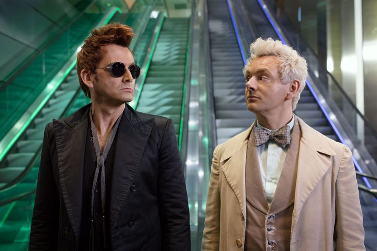

# Good Omens Season 2?

The amazing mini-series based on the best selling novel of the same name
written by **Sir Terry Pratchett and Neil Gaiman** garnered both praise and complaints
when it premiered in June 2019. Rumors are _flying_ about a second season but will
fans get more episodes? 

> When Express asked him in June, Gaiman sounded fairly firm about staying
> away from Hollywood for a while. "So far, Good Omens has taken me four 
> years, or five years since I promised Terry Pratchett I’d make it," he explained.

> “In that five years I haven’t been writing novels," he said, adding, 
> "I have a wife who has not seen enough of me for the last few years and
> is looking forward to me being at home."> 
            
**Gaiman** in _Town and Country_

The actors playing the lead angel and demon, Aziraphale and Crowley respectively
are open to the idea. David Tennant playing Crowley (_pronounced Crawl-ee_) and 
Michael Sheen playing Aziraphale are leaving the decision up to showrunner
and author Gaiman.

Where to watch:
* [Amazon UK](https://www.amazon.co.uk)
* [Amazon US](https://www.amazon.com)
* BBC America (_previously aired_)
 
`It's only six episodes, you can binge it in one day!`
 
